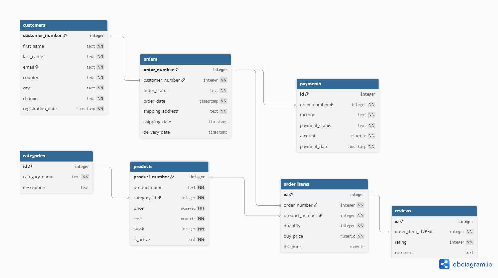

# Team Challenge SQL - Rubén Jiménez Gutiérrez

## Parte 1 - SQL Murder Mystery

### Introducción

SQL Murder Mystery es un pequeña experiencia de juego utilizada para aprender y asentar ciertos conceptos de SQL. En ella usamos nuestros conocimientos de SQL para desentrañar un caso de asesinato utilizando distintas consultas SQL.

### Solución

La investigación y resolución de caso se encuentra en el archivo [investigacion.ipynb](parte_1_sql_murder_mystery/investigacion.ipynb).

## Parte 2 - Modelo Big Query

### Introducción

En la segunda parte del Team Challenge se diseña, implementa y valida un modelo de datos relacional en Tercera Forma Normal (3NF) para una plataforma de comercio electrónico de electrónica y tecnología ("Hyperion Core Technologies").
El objetivo principal es construir una infraestructura analítica robusta sobre Google BigQuery, partiendo de la arquitectura del esquema conceptual y físico, generando datos sintéticos con coherencia de negocio y verificando el rendimiento y la integridad del modelo mediante consultas SQL analíticas. 
El flujo de trabajo se estructura de manera reproducible a través de Jupyter Notebooks organizados por etapas de setup, ingesta y análisis.

### Requisitos y Configuración del Entorno (Setup)

Para reproducir la infraestructura, la ingesta y las consultas analíticas del proyecto, sigue los siguientes pasos:

#### 1. Requisitos previos
* **Python 3.10** o superior.
* Cuenta de **Google Cloud Platform (GCP)** con acceso a **BigQuery** (apto para *Sandbox* / *Free Tier*).
* Un proyecto creado en GCP con la API de BigQuery habilitada.
* Un archivo de credenciales de cuenta de servicio en formato JSON con permisos de edición sobre BigQuery (`BigQuery Admin` o `BigQuery Data Editor` + `BigQuery Job User`).

#### 2. Instalación de dependencias
Se recomienda crear un entorno virtual antes de instalar los paquetes necesarios:

```
# Creación y activación del entorno virtual
python -m venv venv
source venv/bin/activate        # En Linux/macOS
# .\venv\Scripts\activate      # En Windows

# Instalación de librerías
pip install -r requirements.txt
```

#### 3. Configuración de variables de entorno
Crea un archivo .env en la raíz del directorio parte_2_modelo_bigquery/ (este archivo debe estar incluido en .gitignore para no exponer credenciales):

```
GCP_PROJECT_ID="tu-id-de-proyecto-gcp"
BQ_DATASET_ID="id_del_dataset"
GOOGLE_APPLICATION_CREDENTIALS="../credentials/service-account.json"
```

#### 4. Orden de ejecución de los notebooks

Para desplegar y validar el proyecto de forma ordenada, ejecuta los notebooks secuencialmente:
1. 01_setup_bigquery.ipynb: Conecta con GCP, inicializa el cliente de BigQuery, crea el dataset y define el esquema físico de las 7 tablas del modelo.
2. 02_generate_data.ipynb: Genera los volúmenes de datos sintéticos coherentes mediante Faker y random, y los ingesta en BigQuery ejecutando la función load_data con control de errores y validación de filas.
3. 03_queries_verification.ipynb: Lanza las 5 consultas SQL analíticas sobre BigQuery para auditar la integridad relacional y el comportamiento de las métricas de negocio.

### Modelo entidad relación

Se ha diseñado el modelo ER de la base de datos incluyendo tablas para todas las entidades indicadas en el enunciado: customers, categories, products, orders, order_items, payments y reviews. Para esto se han tenido en cuenta las siguientes cuestiones:

Las tablas orders y products se relacionan a través de la tabla intermedia order_items por los siguientes motivos:
  - La relación directa entre products y orders sería muchos a muchos (N:M). Es decir, un pedido puede contener múltiples productos diferentes y un mismo producto puede encontrarse en múltiples pedidos. 
  - Esta relación directa no es viable en el modelo 3NF. Si quisieramos incluir una lista de productos en un pedido estaríamos violando la primera forma normal (1NF).
  - Además la transacción de compra genera atributos propios que no pertenecen ni al pedido global ni al producto del catálogo como son el número de unidades y el precio en el momento de la compra.
  Gracias a la tabla order_items podemos establecer la siguiente relación: 
  - Múltiples líneas de pedido (order_items) pueden tener un mismo número de pedido (order). Lo que significa que dentro del mismo pedido se pueden solicitar múltiples líneas de pedido.
  - Cada línea de pedido representa el producto solicitado con su cantidad, precio y posibles descuentos.
  - De este modo se enlaza a cada pedido los múltiples productos con sus cantidades y precios.

El precio de compra (buy_price) se congela en la tabla order_items en lugar de leerlo directamente de la tabla products ya que el precio de catálogo puede variar con el tiempo y no coincidir con el del momento de la compra.

Los campos country y city residen directamente como atributos de texto en customers en lugar de aislarse en una tabla normalizada countries o cities. Esto cumple un objetivo de eficiencia analítica orientado a Google BigQuery. Evita operaciones de JOIN innecesarias y costosas al realizar agrupaciones y segmentaciones geográficas frecuentes (GROUP BY country, city), además de simplificar la ingesta y generación de datos sintéticos desde Python sin requerir el mantenimiento de catálogos geográficos maestros.

Si en orders almacenásemos el nombre del cliente (customer_name) además de customer_number se violaría la Tercera Forma Normal (3NF) que exige que todos los atributos que no son clave dependan directa y únicamente de la clave primaria, eliminando así las dependencias transitivas (prohíbe las dependencias transitivas). En orders, la clave primaria es order_number. Si añadimos customer_name, este dependería funcionalmente de customer_number, el cual a su vez depende de la clave primaria orders.order_number. Esto generaría redundancia innecesaria y anomalías de actualización (si el cliente cambia de nombre, habría que actualizar múltiples registros históricos en orders).

La entidad reviews se vincula a nivel de línea de pedido (order_item_id) con una relación 1:1 estricta (UNIQUE). Esto garantiza la regla de negocio de "compra verificada" (solo se puede opinar sobre productos realmente adquiridos) y evita que un cliente valore varias veces el mismo producto dentro de un mismo pedido.



Este modelo se ha diseñado utilizando la plataforma [dbdiagram.io](https://dbdiagram.io/) y se puede reproducir en la misma usando el código DBML siguiente:

```
// https://dbdiagram.io/
// Use DBML to define your database structure
// Docs: https://dbml.dbdiagram.io/docs

Table customers {
  customer_number integer [primary key]
  first_name text [not null]
  last_name text [not null]
  email text [unique, not null]
  country text [not null]
  city text [not null]
  channel text [not null]
  registration_date timestamp [not null]
}

Table categories {
  id integer [primary key]
  category_name text [not null]
  description text
}

Table products {
  product_number integer [primary key]
  product_name text [not null]
  category_id integer [not null]
  price numeric [not null]
  cost numeric [not null]
  stock integer [not null, default: 0]
  is_active bool [not null, default: true]
}

Table orders {
  order_number integer [primary key]
  customer_number integer [not null]
  order_status text [not null] // pending, confirmed, shipped, delivered, canceled, returned
  order_date timestamp [not null]
  shipping_address text [not null]
  shipping_date timestamp // Nullable: solo existe tras el despacho
  delivery_date timestamp // Nullable: solo existe tras la entrega
}

Table order_items {
  id integer [primary key]
  order_number integer [not null]
  product_number integer [not null]
  quantity integer [not null]
  buy_price numeric [not null]
  discount numeric [default: 0]
}

Table payments {
  id integer [primary key]
  order_number integer [not null]
  method text [not null] // card, paypal, bizum
  payment_status text [not null] // completed, refunded, pending, failed
  amount numeric [not null]
  payment_date timestamp [not null]
}

Table reviews {
  id integer [primary key]
  order_item_id integer [unique, not null]
  rating integer [not null]
  comment text
}


Ref: products.category_id > categories.id // many-to-one
Ref: orders.order_number < order_items.order_number
Ref: products.product_number < order_items.product_number
Ref: customers.customer_number < orders.customer_number
Ref: order_items.id - reviews.order_item_id
Ref: orders.order_number < payments.order_number
```

### Implementación en BigQuery

Se ha creado el dataset en BigQuery siguiendo los pasos mostrados en el archivo parte_2_modelo_bigquery\notebooks\01_setup_bigquery.ipynb.

Conviene aclarar que las relaciones entre las tablas se definen conceptualmente en el modelo relacional, pero en BigQuery se omiten las constraints para optimizar el rendimiento y evitar restricciones informativas innecesarias.

Ejecutando cada una de las celdas del notebook en orden se puede reproducir la creación del dataset, definición de los esquemas y creación de las tablas.

### Generación de datos sintéticos y carga en BigQuery

Esta parte está resuelta en el notebook parte_2_modelo_bigquery\notebooks\02_generate_data.ipynb.

Para poblar el dataset se generan una serie de datos sintéticos realistas. Se utiliza la librería `Faker` con apoyo de la librería `random` para la generación del set con al menos:
  - 500 clientes
  - 70 productos
  - 2000 pedidos
  - ~4500 líneas de pedido (media 2-3 productos por pedido)
  - Pagos correspondientes a cada pedido
  - Valoraciones para ~35% de los productos entregados \

Se procura que los datos tengan sentido de negocio con precios coherentes, fechas ordenadas, etc.

Posteriormente se implementa la función load_data para cargar cada tabla en BigQuery desde los dataframes generados, incluyendo manejo de errores y validación de carga exitosa.

La ejecución de cada una de las celdas del notebook  en orden permite generar un set de datos similar y cargarlo en BigQuery.

### Queries de verificación

En el notebook parte_2_modelo_bigquery\notebooks\03_queries_verification.ipynb se implementan 5 queries para comprobar el funcionamiento del modelo: 
- Ingresos por mes
- Productos más vendidos
- Clientes por canal por el que conocieron la tienda
- Tiempo medio de entrega
- Rating medio y volumen de opiniones por categoría de producto